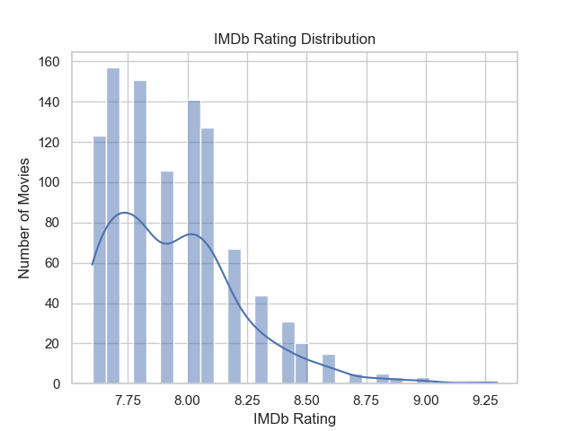
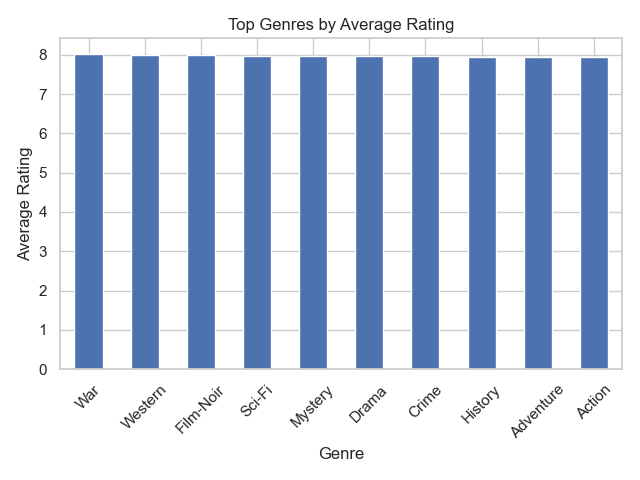
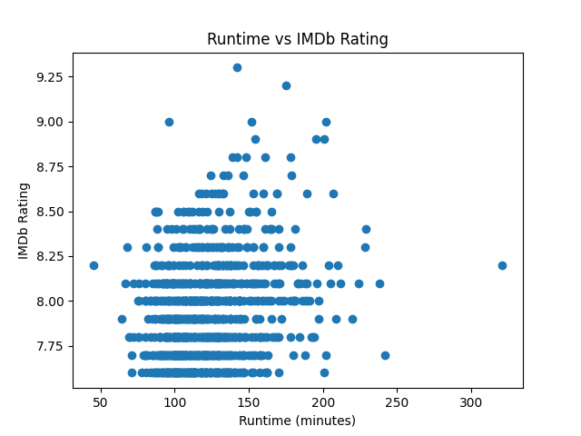
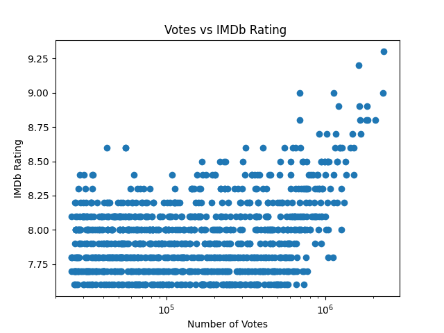
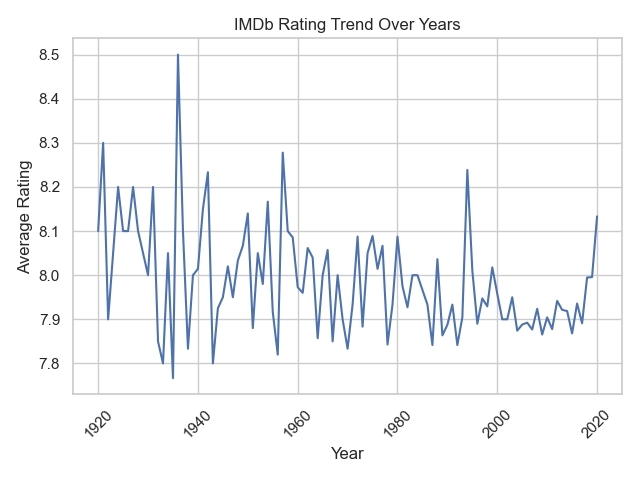
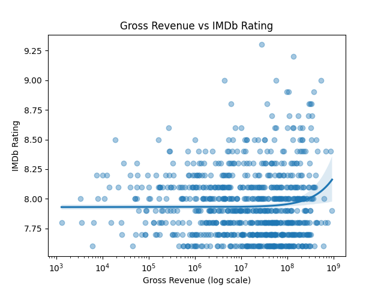

# IMDb Data Analysis Project

## 📌 Objective
Analyze the IMDb Top 1000 movies dataset to explore trends in movie ratings across genres, popularity (number of votes), runtime, and revenue. The goal is to identify patterns and relationships that influence movie ratings.

---

## 🛠️ Tools Used
- Python
- Pandas
- Matplotlib
- Seaborn

---

## 📊 Analysis Performed

### 1. Rating Distribution
- Visualized how IMDb ratings are distributed across movies

### 2. Genre Analysis
- Identified average ratings for different genres
- Used data transformation techniques to handle multiple genres

### 3. Votes vs Rating
- Analyzed relationship between popularity (votes) and ratings
- Used log scale for better visualization

### 4. Runtime vs Rating
- Explored whether longer movies have higher ratings
- Calculated correlation between runtime and ratings

### 5. Rating Trend Over Years
- Analyzed how average ratings change over time

### 6. Gross Revenue vs Rating
- Analyzed relationship between movie gross revenue and IMDb ratings
- Used logarithmic scaling to handle wide range of revenue values
- Applied regression plot to visualize trend

---

## 🔍 Key Insights
- Ratings are relatively similar across genres due to dataset containing top-rated movies
- Popular movies tend to cluster around higher ratings
- Runtime shows weak correlation with ratings
- Ratings remain fairly stable over the years
- Higher revenue does not strongly correlate with higher ratings, indicating commercial success does not always reflect movie quality

---

## 📁 Project Structure

project/
├── imdb_analysis.py
├── imdb_top_1000.csv
├── README.md
├── images/
│ ├── Genre_Trend.png
│ ├── Rating_Distribution.png
│ ├── Runtime_vs_Rating.png
│ ├── Votes_vs_Rating.png
│ ├── Rating_Trend_Over_Years.png
│ └── Gross_vs_Rating.png

---

## 📈 Visualizations

### Rating Distribution

### Genre Analysis

### Runtime vs Rating

### Votes vs Rating

### Rating Trend Over Years

### Gross Revenue vs Rating

---

## 🚀 Conclusion
This project analyzes the IMDb Top 1000 dataset to explore how different factors like genre, popularity, runtime, and revenue relate to movie ratings. The results show that while some trends exist, there is no single factor that strongly determines a movie’s rating. This highlights the complexity of audience preferences and demonstrates the application of data analysis techniques to uncover patterns in real-world data.
